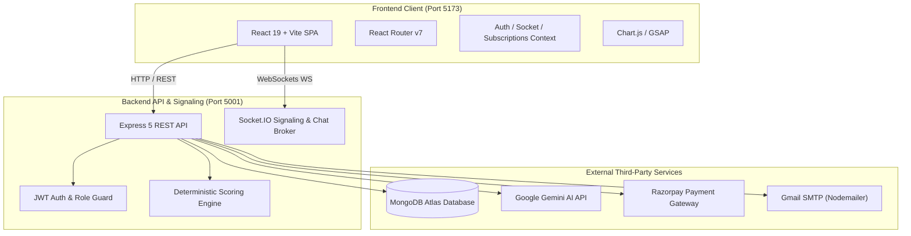
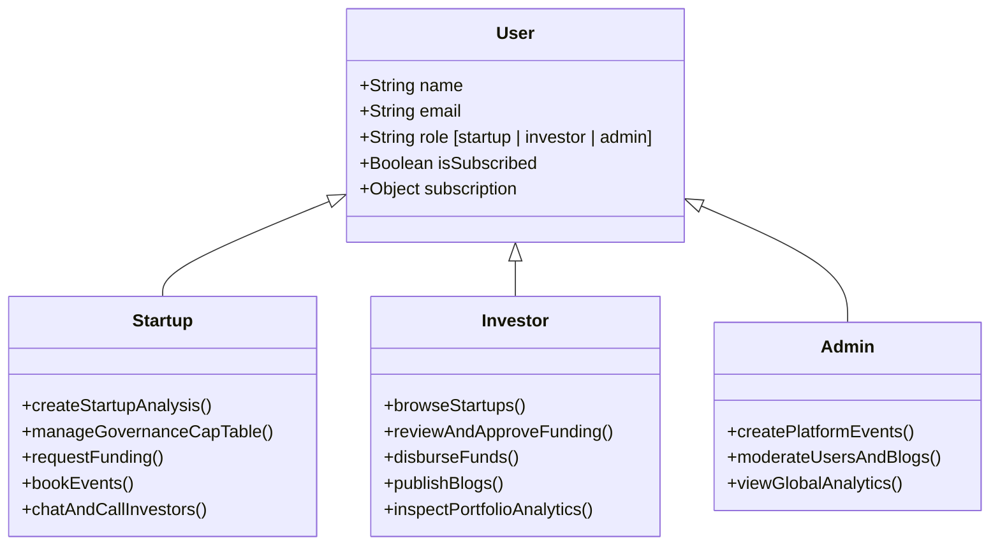
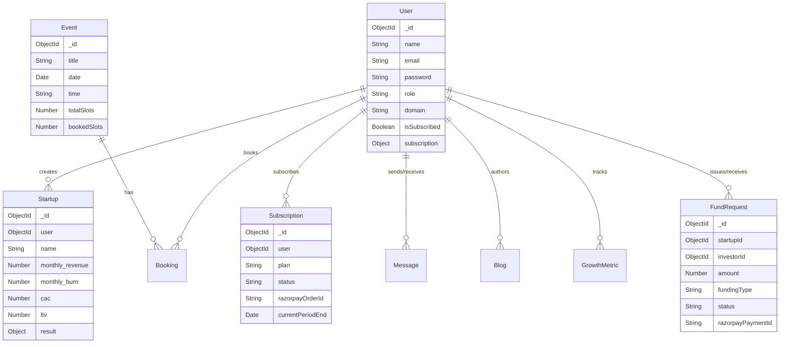
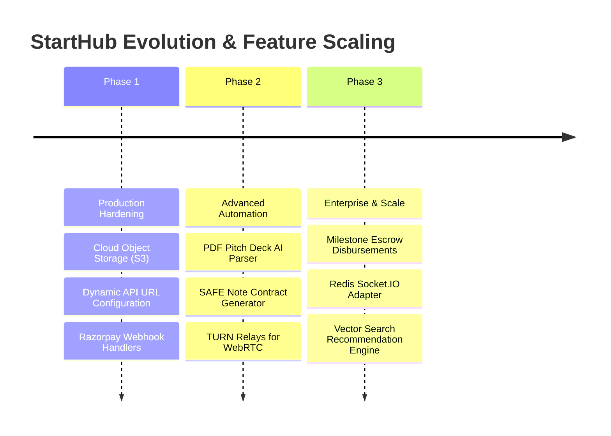

# 🚀 StartHub — Comprehensive Project Architecture & Technical Summary

---

## 1. 📌 Executive Overview

**StartHub** is an end-to-end full-stack SaaS platform designed to bridge the structural gap between early-stage **startups**, angel/institutional **investors**, and platform **administrators**. 

The platform integrates:
- **Algorithmic & Generative AI Viability Scoring:** Evaluates startup business models, unit economics, runway, and team strengths using mathematical scoring algorithms coupled with Google Gemini API strategic analysis.
- **Cap Table Governance & HHI Risk Analytics:** Tracks funding rounds, cap-table dilution, and computes investment concentration using the Herfindahl-Hirschman Index (HHI).
- **Fundraising Lifecycle Management:** Enables founders to issue formal debt/equity funding requests with multi-stage approval workflows and Razorpay settlement integration.
- **Real-Time Collaboration Suite:** WebSocket-driven direct messaging via Socket.IO and peer-to-peer WebRTC video conferencing for investor pitch sessions.
- **Subscription-Gated Event Ticketing:** Automated event scheduling, slot locking, and SMTP email confirmations via Nodemailer.

---

## 2. 🏛️ System Architecture



---

## 3. 🛠️ Technology Stack

| Layer | Technology / Library | Role & Purpose |
|---|---|---|
| **Frontend Framework** | React 19, Vite | Fast Single Page Application (SPA) development and build tooling. |
| **Routing** | React Router DOM v7 | Client-side routing with role-based `ProtectedRoute` wrappers. |
| **Styling & Animation** | Tailwind CSS v4, Lucide React, GSAP | Modern responsive UI, micro-animations, and vector icon sets. |
| **Data Visualization** | Chart.js, react-chartjs-2 | Interactive line charts, bar graphs, radar charts, and doughnut/pie visualizations. |
| **Backend Framework** | Node.js, Express 5 | RESTful API server, route routing, and middleware pipelines. |
| **Database & ODM** | MongoDB, Mongoose 8 | Document database with schema enforcement, virtuals, and hooks. |
| **Real-Time Engine** | Socket.IO 4.7, WebRTC (STUN) | Bidirectional event-driven messaging, room management, and video signaling. |
| **Artificial Intelligence**| Google Generative AI (Gemini SDK) | Generative strategic feedback, SWOT analysis, and idea generation. |
| **Payment Gateway** | Razorpay SDK, Node Crypto | Order generation and HMAC-SHA256 signature verification. |
| **Email Service** | Nodemailer | Transactional booking confirmations and notification dispatch. |
| **Security & Auth** | JWT, BcryptJS, CORS, Multer | Token sessions, password salting, multipart uploads, and origin policies. |

---

## 4. 👥 User Personas & Permissions Matrix



### 1. `startup`
- Build, update, and manage company profiles, pitch decks, and milestones.
- Execute AI Startup Viability Analysis and 12-month financial projections.
- Issue formal Equity/Debt Fund Requests to specific investors.
- Track Cap Table concentration, investor breakdowns, and dilution history.
- Browse and book networking events (gated by active subscription).
- Direct real-time chat and video calls with verified investors.

### 2. `investor`
- Discover startups filtered by industry domain, funding stage, traction, and viability score.
- Review inbound fund requests, accept/reject requests, and disburse capital via Razorpay.
- Portfolio Analytics: track sector allocation, deployed capital, and portfolio ROI metrics.
- Author and publish thought leadership articles/blogs.
- Initiate real-time chat and video meetings with founders.

### 3. `admin`
- Create, schedule, and moderate platform events and pitch sessions.
- Monitor global platform metrics, user growth, and active subscriptions.
- Publish platform announcements, blogs, and manage content moderation.

---

## 5. 🧩 Subsystem & Module Deep Dive

### 5.1. Authentication & Security Pipeline
- **Registration & Hashing:** Passwords hashed with `bcryptjs` (salt rounds: 12) inside Mongoose `pre('save')` hooks.
- **JWT Authentication:** Generates 30-day signed JSON Web Tokens (`jwt.sign`) containing the user's ObjectId.
- **Role Guards:** `protect` middleware extracts bearer tokens from headers; `authorize('admin', 'investor', 'startup')` enforces route-level access control.

---

### 5.2. AI Viability Scoring & Financial Modeling Engine
- **Algorithmic Assessment (`utils/scorer.js`):**
  - **Market Opportunity Score:** Evaluates TAM (Total Addressable Market) and competitive density.
  - **Unit Economics Score:** Analyzes LTV/CAC ratios, gross margins, and customer payback period.
  - **Runway & Burn Health:** Assesses monthly revenue vs. burn rate to calculate financial runway.
  - **Team Competency:** Weighted founder experience rating and historical execution metrics.
- **Generative Strategic Synthesis (`services/openaiClient.js`):**
  - Synthesizes metrics into an investor-grade brief with SWOT breakdown and actionable recommendations using the Google Gemini API.
- **12-Month Projections:** Simulates monthly revenue growth, expense trajectories, and break-even month estimates.

---

### 5.3. Governance, Cap Table & HHI Concentration Analytics
- **Herfindahl-Hirschman Index (HHI):** Measures investor concentration risk:
  $$HHI = \sum_{i=1}^{N} s_i^2$$
  *(where $s_i$ is the percentage share held by investor $i$).*
  - **$HHI < 1500$:** Unconcentrated (Healthy diversification).
  - **$1500 \le HHI \le 2500$:** Moderately Concentrated.
  - **$HHI > 2500$:** Highly Concentrated (High dependency on few investors).
- **Dilution & Funding Rounds Timeline:** Tracks round types (`Pre-Seed`, `Seed`, `Series A`), equity allocations, and cumulative capital raised.

---

### 5.4. Real-Time Chat & WebRTC Video Conferencing
- **WebSocket Broker (`services/socketService.js`):**
  - Handles `user_join`, tracks online presence in an in-memory `Map`, and routes private messages to dedicated socket rooms (`user_${userId}`).
  - Emits `online_users_update` for live presence indicators.
- **WebRTC Signaling:**
  - Facilitates room joining (`join-room`), SDP offer/answer exchanges (`offer`, `answer`), and network candidate discovery (`ice-candidate`) via Google public STUN servers (`stun.l.google.com:19302`).

---

### 5.5. Subscriptions & Payment Gateway
- **Razorpay Order Pipeline:**
  - Creates orders with auto-generated receipt identifiers (`POST /api/subscriptions/create-order` or `/api/payments/order`).
- **Cryptographic Signature Verification:**
  - Validates payment authenticity using HMAC-SHA256:
    $$\text{HMAC-SHA256}(\text{order\_id} + "|" + \text{payment\_id}, \text{RAZORPAY\_KEY\_SECRET}) == \text{razorpay\_signature}$$
- **Tier Structure:**
  - **Basic Plan (₹299/mo):** Basic profile discovery, limited messaging.
  - **Premium Plan (₹799/mo):** Full startup analytics, unlimited messaging, event booking, video calls.
  - **Enterprise Plan (₹1999/mo):** All features, dedicated manager, priority access, custom reporting.

---

### 5.6. Event Management & Automated Email Dispatch
- **Event Creation & Capacity:** Admin defines title, date, time, location, and total seat capacity.
- **Subscription Gate:** Startups must possess an active subscription (`user.isSubscribed === true`) to reserve a slot.
- **SMTP Nodemailer Integration:** Dispatches automated HTML confirmation receipts upon successful slot reservation.

---

## 6. 🗄️ Database Schemas & Data Model Reference



---

## 7. 📡 Complete API Route Catalogue

| Route Prefix | Method | Endpoint | Access | Purpose |
|---|---|---|---|---|
| **`/api/auth`** | `POST` | `/register` | Public | Register user (`startup`, `investor`, `admin`) |
| | `POST` | `/login` | Public | Authenticate user & return JWT session token |
| | `GET` | `/me` | Protected | Fetch current logged-in user profile |
| **`/api/startups`** | `POST` | `/` | Authenticated | Execute AI startup analysis and save valuation |
| | `GET` | `/user/:userId` | Authenticated | Fetch startup analyses for a founder |
| | `GET` | `/profile/:startupId` | Public | Fetch comprehensive public startup profile |
| | `GET` | `/growth/:startupId` | Public | Fetch startup growth metrics history |
| **`/api/governance`**| `GET` | `/startup/:startupId/investors` | Protected | Fetch startup cap-table & investor breakdown |
| | `GET` | `/startup/:startupId/concentration` | Protected | Fetch HHI concentration analytics |
| | `GET` | `/startup/:startupId/timeline` | Protected | Fetch historical funding timeline |
| **`/api/fund-requests`**| `POST` | `/` | Startup Only | Create a new equity/debt funding request |
| | `GET` | `/user/:userId` | Authenticated | Fetch inbound/outbound funding requests |
| | `PUT` | `/:id/approve` | Investor Only | Approve a pending funding request |
| | `PUT` | `/:id/reject` | Investor Only | Reject a pending funding request |
| | `POST` | `/:id/payment` | Investor Only | Disburse funding & verify Razorpay payment |
| **`/api/investor-analytics`**| `GET` | `/:investorId/portfolio` | Investor Only | Investor portfolio stats & breakdown |
| | `GET` | `/:investorId/trends` | Investor Only | Monthly investment & return trends |
| **`/api/subscriptions`**| `GET` | `/plans` | Public | Fetch subscription tiers and pricing |
| | `POST` | `/create-order` | Authenticated | Create Razorpay subscription order |
| | `POST` | `/validate-payment` | Authenticated | Verify signature and activate plan |
| | `GET` | `/user/:userId` | Authenticated | Fetch active user subscription |
| **`/api/events`** | `GET` | `/` | Authenticated | Browse available platform events |
| | `POST` | `/` | Admin Only | Create a new event or demo day |
| **`/api/bookings`** | `POST` | `/` | Subscribed User | Book event slot & trigger confirmation email |
| | `GET` | `/user/:userId` | Authenticated | Fetch booked events for a user |
| **`/api/blogs`** | `GET` | `/blogs` | Public | List all published blog articles |
| | `POST` | `/blogs` | Admin / Investor| Publish article with image/video attachments |
| **`/api/chat`** | `GET` | `/messages/:u1/:u2` | Authenticated | Fetch direct conversation history |

---

## 8. 🔐 Environment Configuration

### Backend (`backend/.env`)
```env
PORT=5001
MONGO_URI=mongodb+srv://<username>:<password>@cluster0.mongodb.net/test?authSource=admin&retryWrites=true&w=majority
JWT_SECRET=your_secure_random_jwt_secret_key
GEMINI_API_KEY=your_google_gemini_api_key
RAZORPAY_KEY_ID=your_razorpay_key_id
RAZORPAY_KEY_SECRET=your_razorpay_key_secret
EMAIL_USER=your_email@gmail.com
EMAIL_PASS=your_16_character_google_app_password
```

### Frontend (`frontend/.env`)
```env
VITE_RAZORPAY_KEY_ID=your_razorpay_key_id
VITE_API_URL=http://localhost:5001
```

---

## 9. 🚀 Future Roadmap & Scaling Opportunities



1. **AI Due Diligence & Pitch Deck OCR (Gemini 2.0 Multimodal):**
   Allow founders to drag-and-drop 10-slide pitch decks (PDF) and let Gemini extract financials, competitive positioning, and market size automatically.
2. **Automated SAFE & Convertible Note Generator:**
   Auto-compile legally standardized SAFE (Simple Agreement for Future Equity) and loan agreements as downloadable PDFs upon investor request approval.
3. **Milestone-Gated Escrow Smart Accounts:**
   Release funding in tranches (e.g. 30% initial, 70% upon verifying monthly active user or revenue milestones).
4. **Cloud Media Storage (AWS S3 / Cloudinary):**
   Transition local disk file uploads (`backend/uploads/`) to cloud object storage for stateless server deployments.
5. **Horizontal Scaling with Redis:**
   Add `@socket.io/redis-adapter` and Redis caching for distributed session handling and microsecond latency across multi-instance clusters.
